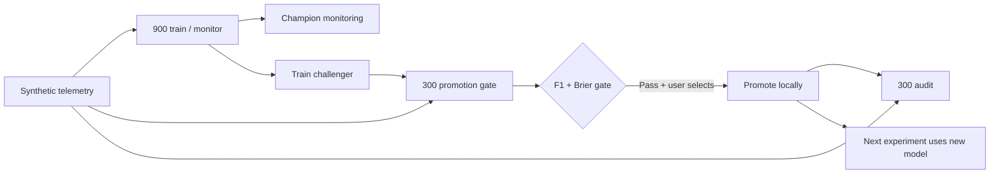

# ML Drift Control Room

**A hands-on model-operations lab: train, monitor, break, evaluate, promote and roll back a real classifier.**

An ML engineering portfolio project by Nemanja Stancic. It uses synthetic equipment telemetry to demonstrate a failure that is easy to miss in dashboards: stable input distributions can hide a broken relationship between features and outcomes.

## Run locally

Install **Python 3.12**, then run from this directory:

```sh
python run.py
```

Use `python3 run.py` on macOS/Linux. The launcher creates a virtual environment and installs pinned direct dependencies on first run. Open **http://127.0.0.1:4182**. No API key, GPU or paid service. Training and inference run locally. Ctrl+C stops the server.

Manual setup:

```powershell
python -m venv .venv
.venv/Scripts/python -m pip install -r requirements.txt
.venv/Scripts/python -m uvicorn app:app --host 127.0.0.1 --port 4182
```

On Unix use `.venv/bin/python`. API documentation: `/docs`.

## Five-minute recruiter walkthrough

1. Run **Stable conditions**, seed `42`, threshold `0.5`. Inspect probabilities, F1, average precision and Brier loss.
2. Run **Hidden concept shift** at 100%. Input histograms can look stable while predictive performance collapses.
3. Click **Train challenger**. A new logistic-regression pipeline learns from the first 900 labeled records. The separate 300-row gate decides whether it qualifies for promotion.
4. If the gate passes, **Promote locally**. The untouched 300-row audit set is then revealed. Run a fresh experiment to see the new model score current data.
5. **Reset to baseline**, turn off labels, and rerun. F1 disappears and training is blocked. Distribution checks cannot substitute for outcome measurement.
6. Try **Sensor distribution shift** and **Missing vibration sensor**. Export a JSON report of the experiment, candidate and events.

The default concept-shift fixture is intentionally strong enough to demonstrate a recoverable failure; other scenarios can correctly **fail** the promotion gate.

## Under the hood

| Component | Real implementation |
|---|---|
| Model | Median imputation → standard scaling → scikit-learn logistic regression |
| Baseline | 3,500 synthetic labeled rows, fixed seed 101 |
| Reference distribution | Separate 1,500-row sample, seed 202 |
| Monitoring | Four KS tests with Bonferroni threshold 0.05 / 4; missingness alert over 5% |
| Quality | F1, precision, recall, average precision, Brier loss, confusion matrix |
| Challenger | Fitted only on the 900-row training partition |
| Promotion | F1 gain ≥ 0.02 and Brier increase ≤ 0.02 on 300 gate rows |
| Final audit | 300 untouched rows, revealed after candidate selection |
| Release state | In-memory version, idempotent promotion, stale-candidate rejection, baseline rollback |
| Traceability | Seed, config, dataset hash and bounded session event log; JSON export |



## What the scenarios mean

- **Stable:** the data-generating relationship stays the same. Statistical noise is normal; retraining may not improve it.
- **Sensor distribution shift:** temperature and vibration values shift, but the conditional relationship to failures remains unchanged. An input alert does not automatically imply lower quality.
- **Concept shift:** feature distributions stay the same, but model weights in the synthetic ground-truth generator change, including reversing vibration's relationship to failure. A KS monitor can miss this completely.
- **Missing sensor:** vibration values disappear after outcomes are generated. Imputation keeps inference running; it cannot restore lost information.

The UI reports model probabilities as risk scores, not promises of calibrated real-world failure likelihood. Synthetic labels let the lab measure quality immediately; real equipment outcomes would usually arrive later.

## Tests

```powershell
.venv/Scripts/python -m pytest -q
```

Seven tests cover reproducible data, concept-shift failure and recovery, input/missingness alerts, hidden-label enforcement, promotion/audit/idempotency, stale candidates, rollback, API bounds and origin checks. Tests were run locally on Windows/Python 3.12. `ci/checks.yml` is a ready-to-enable GitHub Actions template; automatic CI is not enabled because the upload credential lacks workflow permission. With an appropriately authorized GitHub login, place it in `.github/workflows/checks.yml` to enable it.

## Decisions and honest limits

- **Avoiding leakage:** the imputer and scaler are fitted inside each training pipeline. No gate or audit rows enter training. Monitoring metrics use the training partition before challenger fitting; candidate gate/audit metrics use separate rows.
- **Audit discipline:** audit results are hidden until selection. Repeating the same seed or using earlier audit results to tune future experiments still risks benchmark overfitting. A production release needs fresh independent validation, minimum sample requirements, subgroup analysis and uncertainty estimates.
- **Statistical limits:** KS tests assume suitable independent samples; autocorrelation and multiple repeated monitoring windows affect false-positive rates. Bonferroni here covers four sensors in one window, not repeated experiments. A p-value is not an operational impact estimate.
- **Fixed gate:** the 0.02 thresholds are illustrative policy choices, not statistically established guarantees. No confidence-interval-based release decision, fairness study or safety certification is claimed.
- **Local release only:** “promote” swaps the model used by this Python process. No Kubernetes, cloud deployment, canary, MLflow registry or durable model artifact service is implied. Restarting restores the baseline and clears run/release history. Export reports before stopping.
- **Shared session:** one experiment and candidate at a time, protected by a lock. No authentication, user isolation or production access policy. Bind only to loopback; Host/Origin checks provide basic local-request protection.
- **No magic AI API:** actual training and inference use scikit-learn. This is an ML engineering demo, not a chatbot or an LLM wrapper.
- Direct dependencies are pinned; `requirements-lock.txt` records the tested Windows/Python 3.12 environment.

## Extend it to learn

1. Add confidence intervals to the promotion gate and compare decisions at different sample sizes.
2. Add a time-dependent generator, rolling windows and delayed labels. Measure repeated-alert false positives.
3. Persist models in a versioned artifact store, plus a model card and a training-data fingerprint.
4. Add a shadow-deployment adapter that scores both models before any rollout.
5. Replace synthetic telemetry with a properly licensed real dataset and design a temporal holdout.

## 2026 hiring relevance

Qualitative primary-source examples checked September 17, 2026; not market-wide demand statistics:

- [Hungryroot — Senior Machine Learning Operations Engineer](https://job-boards.greenhouse.io/hungryroot/jobs/6141572004): model serving, model versioning, monitoring, drift and safe rollout/rollback workflows.
- [Garner Health — Staff MLOps Engineer](https://job-boards.greenhouse.io/garnerhealth/jobs/6030505004?gh_src=856530bc4us): ML platform validation and data/concept drift monitoring.

These are examples of relevant engineering areas, not a claim that this mini-project meets every requirement or seniority level. Listings can close.

## Technical references

- [scikit-learn model evaluation](https://scikit-learn.org/stable/modules/model_evaluation.html)
- [SciPy two-sample KS test](https://docs.scipy.org/doc/scipy/reference/generated/scipy.stats.ks_2samp.html)
- [scikit-learn common pitfalls and data leakage](https://scikit-learn.org/stable/common_pitfalls.html)
